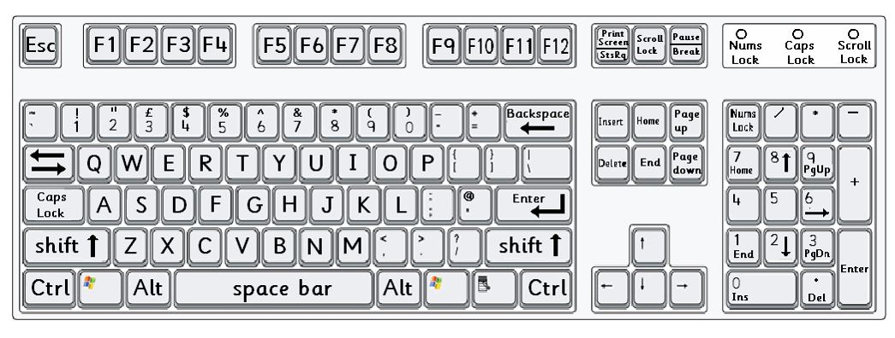
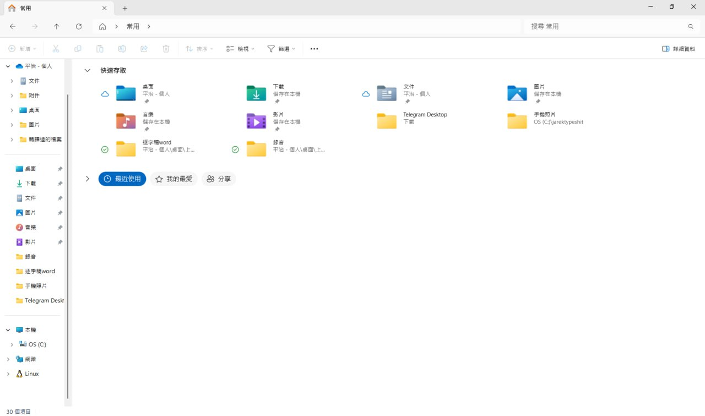

title: Basic computer
output: test-cleaver.html

--
<h1 style="font-size:72px">
    Welcom
</h1>
 

--

<h1 style="font-size:72px">
    基本電腦操作
</h1>
 

--

  

  
    Source:&nbsp;
  <a "https://www.barhamprimary.co.uk/page/?title=Computer+Mouse+and+Keyboard+Skills&pid=135"</a>&nbsp;
  

--

   

